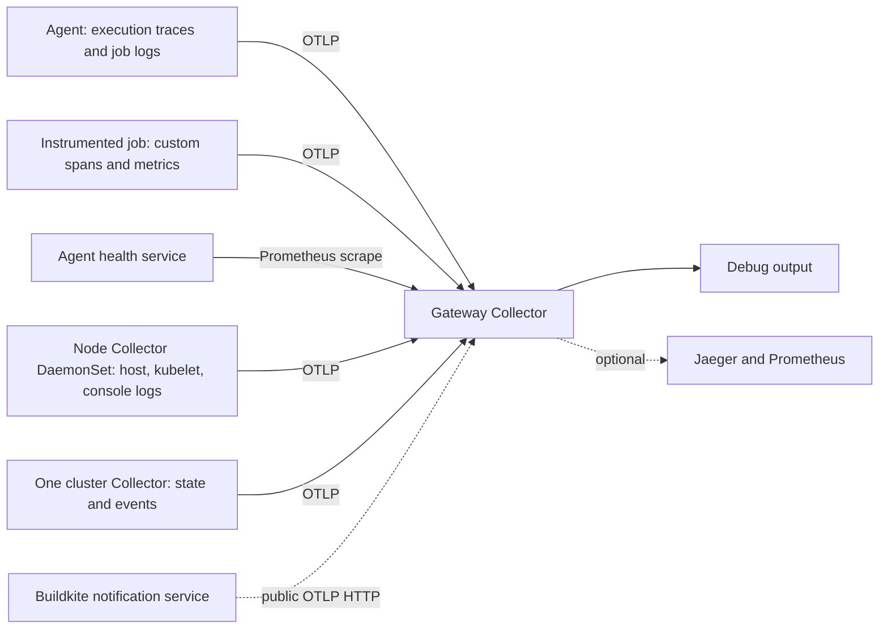

# OpenTelemetry + Kubernetes + Buildkite: a hands-on tutorial

Learn **where telemetry comes from, how it travels, and what it tells you**. Run one stage, inspect its output, and answer its checkpoint before continuing. Allow two or three learning sessions. Commands run from the repository root.

This lab uses self-hosted Buildkite agents on Linux Kubernetes nodes. First, run a long-lived agent in a Deployment to understand the pieces. Later, apply the design to Agent Stack for Kubernetes, where a controller creates pods for individual jobs.

Examples pin Collector chart `0.173.1` / image `0.160.0` and Python SDK `1.36.0`. The agent image uses `buildkite/agent:3-ubuntu` pinned by digest to verified agent `3.137.2`. Check installed flags and the feature minimums below when changing versions. See [Buildkite's v3 Docker image documentation](https://buildkite.com/docs/agent/v3/docker).

## 1. Map the signals and sources

| Term | Meaning | Example |
| --- | --- | --- |
| Trace | Related timed operations | One job's execution |
| Span | One timed operation in a trace | The test phase |
| Metric | Numeric measurements over time | Running jobs or container memory |
| Log | An individual event record | Test output or a scheduling event |
| Resource | Entity producing telemetry | A service or Kubernetes pod |
| Attribute | Context attached to telemetry | Pod UID, pipeline, outcome |
| OTLP | OpenTelemetry transport protocol | gRPC on 4317; HTTP on 4318 |
| Collector | Receives, processes, and exports data | Adds pod metadata and forwards spans |
| Backend | Stores and queries telemetry | Jaeger for traces; Prometheus for metrics |

OTel provides instrumentation and collection. You still need storage and a UI for historical exploration. Begin with the Collector's `debug` exporter to inspect each record.



There are **two meanings of cluster**. A Kubernetes cluster contains nodes and workloads. A Buildkite cluster groups queues and agents. Kubernetes receivers observe the former; Buildkite queue/fleet telemetry needs Buildkite sources.

**Predict:** Which signals distinguish “tests are slow” from “the job is waiting for capacity”?

## 2. Prepare your playground

You need `kubectl`, Helm 3, a working Linux Kubernetes cluster, and permission to create namespaces and Collector RBAC. Rancher Desktop, kind, or minikube is suitable. The agent needs network access to Buildkite and your Git repository. Docker is needed for the Python agent image later.

```bash
kubectl config current-context
kubectl get nodes
helm version
kubectl get namespaces
```

Read the context before deploying. Use a learning cluster. Create separate namespaces:

```bash
kubectl create namespace otel-lab
kubectl create namespace buildkite
helm repo add open-telemetry https://open-telemetry.github.io/opentelemetry-helm-charts
helm repo update
```

If a namespace exists, inspect it and skip creation. Node collection needs host log mounts, which some admission policies restrict.

### Rancher Desktop memory and scheduling

The full demo's regular containers request approximately **9,072 MiB (8.86 GiB)**, before Kubernetes system workloads, init-container requirements, and tutorial resources. This is based on the supplied manifest with one replica per workload and one node for its DaemonSet. Kubernetes normally uses a container's memory limit as its request when no request is provided. Scheduling compares requests with allocatable node memory, not just current usage. See [Kubernetes resource management](https://kubernetes.io/docs/concepts/configuration/manage-resources-containers/).

If pods are Pending with `Insufficient memory`, inspect:

```bash
kubectl get nodes -o custom-columns=NAME:.metadata.name,MEMORY:.status.allocatable.memory
kubectl describe node
kubectl get events --all-namespaces --field-selector=reason=FailedScheduling
```

In `kubectl describe node`, compare **Allocatable** memory with **Allocated resources → Requests**. A container that has not started can still reserve memory after its pod is assigned to a node.

For Rancher Desktop on macOS, open **Preferences → Virtual Machine → Hardware → Memory**. If your Mac has enough spare RAM, 12 GiB is a starting allocation for this full demo and lab; leave room for macOS and other applications and stay outside the app's red allocation range. Apply the change and allow any requested restart. See [Rancher Desktop hardware settings](https://docs.rancherdesktop.io/ui/preferences/virtual-machine/hardware/).

For a smaller learning setup, defer the full demo until step 9. If it is already installed, pause only demo workloads you choose to stop. For example, its load generator requests 1,500 MiB:

```bash
# Use the namespace where you installed the demo; default is shown here.
kubectl -n default scale deployment/load-generator --replicas=0
```

Other Pending pods may consume the freed capacity, so check scheduling again. Restore the load generator with `--replicas=1` when you have enough capacity.

### Choose which agent setup to run

| Deployment | What its pod does |
| --- | --- |
| `buildkite-agent` | Runs the standalone agent used in steps 4–10 |
| `agent-stack-k8s` | Runs the controller that creates per-job agent pods in step 11 |

If you previously installed Agent Stack, both can appear in namespace `buildkite`. They are different components, not two revisions of the same agent. Inspect their owners and desired counts:

```bash
kubectl -n buildkite get pods \
  -o custom-columns=NAME:.metadata.name,OWNER:.metadata.ownerReferences[0].name
kubectl -n buildkite get replicasets \
  -o custom-columns=NAME:.metadata.name,DEPLOYMENT:.metadata.ownerReferences[0].name,DESIRED:.spec.replicas
kubectl -n buildkite get deployments
```

A Deployment owns ReplicaSets, which own pods. Deleting a pod alone usually causes its controller to create a replacement. To pause the existing Agent Stack controller while doing the standalone exercises, use its actual Deployment name:

```bash
# Run only if this is your learning controller and no new stack jobs are needed.
kubectl -n buildkite scale deployment/agent-stack-k8s --replicas=0
kubectl -n buildkite get pods
```

This keeps the controller's configuration but stops it from processing new jobs. It does not remove existing job pods. Restore it before step 11:

```bash
kubectl -n buildkite scale deployment/agent-stack-k8s --replicas=1
```

A Helm upgrade or another configuration manager may restore its configured replica count. These commands pause the Deployment; they do not uninstall Agent Stack.

Your existing `opentelemetry-demo.yaml` contains a DaemonSet Collector, Jaeger, Prometheus, OpenSearch, and sample services. Its Collector already has host/kubelet/cluster receivers, with leader election for cluster collection. Its log pipeline accepts OTLP but has no filelog receiver. Its Service uses `internalTrafficPolicy: Local`, requiring a ready local endpoint on the sending node. This tutorial uses a separate gateway with ordinary cluster routing.

**Checkpoint:** Why use a Service address instead of a pod IP as the telemetry destination?

## 3. Build a gateway

Read [gateway-values.yaml](gateway-values.yaml). Receivers accept data; processors transform it; exporters send it onward. `service.pipelines` activates components separately for traces, metrics, and logs. Declaring an exporter alone does not enable it.

The gateway accepts both OTLP transports. The chart supplies health checks, batching, and a memory limiter. A preset adds Kubernetes metadata and RBAC. `resource/lab` adds a learning cluster name.

Preview the resources:

```bash
helm template otel-gateway open-telemetry/opentelemetry-collector \
  --version 0.173.1 -n otel-lab -f tutorial/gateway-values.yaml \
  > /tmp/otel-gateway-rendered.yaml
```

Inspect the ConfigMap, Deployment, Service, and ClusterRole. Compare the actual Collector config with Helm values: they are different layers.

```bash
helm upgrade --install otel-gateway open-telemetry/opentelemetry-collector \
  --version 0.173.1 -n otel-lab -f tutorial/gateway-values.yaml
kubectl -n otel-lab rollout status deployment/otel-gateway
kubectl -n otel-lab get service otel-gateway
kubectl -n otel-lab logs deployment/otel-gateway --tail=60
```

Readiness proves the Collector started. It does not prove that any telemetry arrived.

**Experiment:** Find all three pipelines in the ConfigMap. What happens if `otlp` is removed from the trace pipeline's receiver list?

## 4. Collect agent traces and job logs

Create a learning Buildkite pipeline pointing to a Git repository containing this tutorial, and a self-hosted queue named `otel-lab`. Use an agent token for the appropriate Buildkite cluster. Private repositories also require Git credentials; start with a repository the agent can clone.

Create the queue in Buildkite before starting the agent: open **Agents**, select the cluster associated with your token, open **Queues**, then **New Queue**. Enter queue key `otel-lab`, choose **Self hosted**, and create it. The queue tag in Kubernetes selects an existing Buildkite queue; it does not create one. See [managing Buildkite queues](https://buildkite.com/docs/agent/queues/managing).

Use the existing `BUILDKITE_AGENT_TOKEN` variable from your Bash profile to populate the token Secret. These commands use Bash; run `bash` first if your terminal uses another shell. If the variable is not loaded in that shell, run:

```bash
source ~/.bash_profile
```

If `buildkite-agent-token` does not exist yet, create the empty Secret first. Skip this command if it already exists:

```bash
kubectl -n buildkite create secret generic buildkite-agent-token
```

Populate or update its token field with the working command below:

```bash
: "${BUILDKITE_AGENT_TOKEN:?Load BUILDKITE_AGENT_TOKEN first}"

printf '%s' "$BUILDKITE_AGENT_TOKEN" | \
  python3 -c 'import json,sys; print(json.dumps({"stringData":{"BUILDKITE_AGENT_TOKEN":sys.stdin.read().strip()}}))' | \
  kubectl -n buildkite patch secret buildkite-agent-token \
    --type=merge --patch-file=/dev/stdin
```

After the Secret exists, deploy the agent:

```bash
kubectl apply -f tutorial/agent.yaml
kubectl -n buildkite rollout status deployment/buildkite-agent
kubectl -n buildkite logs deployment/buildkite-agent --tail=60
```

Read [agent.yaml](agent.yaml). Tracing, job-log export, endpoint, and protocol are configured **when the agent starts**. Setting them inside a job cannot configure its parent agent. Job-log export is independent of tracing and requires agent `3.135.0` or later; child-process trace propagation requires `3.100.0` or later. See [agent tracing and log export](https://buildkite.com/docs/agent/self-hosted/monitoring-and-observability/tracing).

In `secretKeyRef`, `name` identifies the Secret object and `key` identifies a field inside it. Both must match the existing Secret. This lab uses Secret `buildkite-agent-token` with field `BUILDKITE_AGENT_TOKEN`, loaded into the environment variable of the same name. To inspect field names without printing their values:

```bash
kubectl -n buildkite get secret buildkite-agent-token \
  -o go-template='{{range $key, $value := .data}}{{printf "%s\n" $key}}{{end}}'
```

For the verified v3.137.2 image, tracing uses `BUILDKITE_TRACING_BACKEND=opentelemetry`, `BUILDKITE_TRACING_PROPAGATE_TRACEPARENT=true`, and `BUILDKITE_TRACING_SERVICE_NAME`. These were checked against the image's `buildkite-agent start --help`. Newer documentation uses renamed settings; check your actual binary instead of mixing versions.

This single-agent lab uses `strategy.type: Recreate`: updates remove the old pod before starting its replacement, avoiding the extra memory reservation of a rolling update. The explicit `rollingUpdate: null` clears an existing rolling-update configuration when applying this manifest. Agent updates temporarily remove capacity, so do them between learning jobs. See [Kubernetes Deployment strategies](https://kubernetes.io/docs/concepts/workloads/controllers/deployment/#strategy).

### Change the agent's Buildkite cluster

The registration token selects the Buildkite cluster; the queue tag selects a queue within it. To move the standalone agent, obtain an agent token from **Agents → intended cluster → Agent Tokens**. Create one there if needed. Confirm that the same cluster has a self-hosted queue with key `otel-lab` and that your learning pipeline is assigned to that cluster. See [Buildkite agent tokens](https://buildkite.com/docs/agent/self-hosted/tokens).

Make sure `BUILDKITE_AGENT_TOKEN` in `~/.bash_profile` contains the agent token for the intended cluster. Run this block in Bash to load that variable and update the existing Kubernetes Secret:

```bash
source ~/.bash_profile
: "${BUILDKITE_AGENT_TOKEN:?Load BUILDKITE_AGENT_TOKEN first}"

printf '%s' "$BUILDKITE_AGENT_TOKEN" | \
  python3 -c 'import json,sys; print(json.dumps({"stringData":{"BUILDKITE_AGENT_TOKEN":sys.stdin.read().strip()}}))' | \
  kubectl -n buildkite patch secret buildkite-agent-token \
    --type=merge --patch-file=/dev/stdin
```

This uses the existing profile variable without a `read` prompt or a temporary token file. The guard checks that the variable is set and nonempty; Python converts its value to a JSON patch. Keep the pipe to `kubectl` intact so the token is not printed. Editing your Bash profile alone does not update the Kubernetes Secret.

After the patch succeeds, restart the agent so its environment loads the new Secret value:

```bash
kubectl -n buildkite rollout restart deployment/buildkite-agent
kubectl -n buildkite rollout status deployment/buildkite-agent
kubectl -n buildkite logs deployment/buildkite-agent --tail=60
```

Verify the agent appears under the intended cluster and queue in Buildkite. Changing a Secret does not refresh an existing process's environment. The fleet metrics exercise shares this Secret; restart that Deployment too if installed. The Agent Stack controller in this setup uses the separate `agent-stack-k8s-secrets` Secret and is not moved by this change.

**Checkpoint:** Explain each hop: Bash-profile variable → Kubernetes Secret field → agent environment after restart. Which hop changes when you edit only your local profile?

Start with this inline pipeline step:

```yaml
steps:
  - label: "First telemetry"
    agents:
      queue: otel-lab
    command: |
      echo "hello from the OTel lab"
      sleep 3
```

Run a build and watch:

```bash
kubectl -n otel-lab logs deployment/otel-gateway -f
```

Find spans with service name `buildkite-agent` and a log containing the greeting. Inspect actual names and attributes; their shape can vary with agent versions. Agent spans show execution phases, not every operation inside your shell script.

**Checkpoint:** Why does the delay affect timing, while each shell command does not automatically become its own span?

## 5. Scrape agent metrics

The agent's health service exposes `/metrics` on port 3901. Available from agent `3.113.0`, it includes `buildkite_agent_jobs_running` and `buildkite_agent_jobs_started_total`. See [agent monitoring](https://buildkite.com/docs/agent/self-hosted/monitoring-and-observability).

Inspect the source first:

```bash
kubectl -n buildkite port-forward service/buildkite-agent-metrics 3901:3901
```

In another terminal:

```bash
curl -s http://localhost:3901/metrics
```

Add a Prometheus receiver to the gateway:

```bash
helm upgrade otel-gateway open-telemetry/opentelemetry-collector \
  --version 0.173.1 -n otel-lab \
  -f tutorial/gateway-values.yaml -f tutorial/agent-metrics-values.yaml
kubectl -n otel-lab rollout status deployment/otel-gateway
```

Run a `sleep 30` job and watch the gauge change. Wait at least ten seconds for a scrape. Very short jobs can run between scrapes; counters still reveal that they ran.

This Service target works for our **one-agent** lab. For a fleet, discover and scrape each pod address. A load-balanced Service can alternate between processes, producing misleading counters. Keep one scraper per target or intentionally shard scrapes.

**Checkpoint:** Gauges report current values; counters accumulate events and reset on process restart. Which measures jobs currently running?

## 6. Collect node, pod, and container telemetry

Read [node-values.yaml](node-values.yaml), then install it:

```bash
helm upgrade --install otel-node open-telemetry/opentelemetry-collector \
  --version 0.173.1 -n otel-lab -f tutorial/node-values.yaml
kubectl -n otel-lab rollout status daemonset/otel-node
kubectl -n otel-lab get pods -o wide
```

The DaemonSet runs on each eligible node. `hostmetrics` observes the host; `kubeletstats` observes node/pod/container usage; `filelog` reads runtime console logs. Presets add receivers, mounts, and permissions to the rendered config even though our base receiver lists are empty. See [Collector Helm presets](https://opentelemetry.io/docs/platforms/kubernetes/helm/collector/).

Logs are restricted to the `buildkite` namespace. Collecting the gateway's debug output would feed exported telemetry back into itself. Collection starts at the end of existing files: generate fresh output after installation.

Find host and Kubernetes metrics in gateway output. Run another greeting job and inspect console logs. **Console logs and exported job logs are different sources:** filelog captures container stdout/stderr; agent job export captures the Buildkite job stream. They may overlap, and job output is not necessarily mirrored to container stdout.

**Experiment:** Compare the agent's node in `kubectl get pods -o wide` with a node attribute on a metric. Why would one Collector Deployment miss usage on other nodes?

## 7. Collect cluster state and events

```bash
helm upgrade --install otel-cluster open-telemetry/opentelemetry-collector \
  --version 0.173.1 -n otel-lab -f tutorial/cluster-values.yaml
kubectl -n otel-lab rollout status deployment/otel-cluster
```

Read [cluster-values.yaml](cluster-values.yaml). One Collector observes cluster state and events. Using one replica makes ownership clear and avoids repeated cluster-wide observations. Some newer charts support leader election for multiple replicas.

Create a deliberately unschedulable pod after the Collector starts:

```bash
kubectl -n buildkite run pending-lab --image=busybox:1.37 \
  --overrides='{"spec":{"nodeSelector":{"otel-lab-no-such-node":"true"}}}' \
  --command -- sleep 300
kubectl -n buildkite describe pod pending-lab
kubectl -n otel-lab logs deployment/otel-gateway --since=2m
```

Find `FailedScheduling` in Kubernetes and collected event logs. Give the event receiver time to establish its watch before generating the event.

**Checkpoint:** A pod can be Pending with no agent spans because its container never started. Which signal shows where it got stuck?

```bash
kubectl -n buildkite delete pod pending-lab
```

## 8. Instrument work inside a job

Read [job.py](job.py). Locate the SDK providers, exporters, parent-context extraction, child spans, JSON output, metrics, and final flush.

The script explicitly extracts agent-provided `TRACEPARENT` and `TRACESTATE`, continuing the existing trace. Without a parent it starts a new trace. Sharing an endpoint or job ID does not establish parentage. See [Python instrumentation](https://opentelemetry.io/docs/languages/python/instrumentation/) and [exporters](https://opentelemetry.io/docs/languages/python/exporters/).

Build an agent image with Python and SDK dependencies:

```bash
docker build -t otel-buildkite-lab:1 tutorial
```

Make it available to your cluster. For kind:

```bash
kind load docker-image otel-buildkite-lab:1
kubectl -n buildkite set image deployment/buildkite-agent agent=otel-buildkite-lab:1
```

For another cluster, use its documented local-image mechanism, or push to a registry nodes can pull from and use that image reference in `kubectl set image`. Configure `imagePullSecrets` when needed.

```bash
kubectl -n buildkite rollout status deployment/buildkite-agent
```

Push the tutorial files to your pipeline's repository. Set its initial command to:

```bash
buildkite-agent pipeline upload tutorial/pipeline.yml
```

Route that initial upload step to `queue: otel-lab` too. Run a build. Find `ci.exercise`, `prepare`, `test`, and `package`, sharing a trace ID with their agent ancestry. Find `lab.ci.runs` and `lab.ci.duration` after the process exits. Backends may normalize metric names.

JSON stdout includes the script's trace/span IDs. Native agent job-log records carry the agent execution context; their span ID need not match the child span ID embedded in the JSON body.

Change the exercise step's command to:

```bash
LAB_PHASE_SECONDS=3 LAB_FAIL=1 /opt/otel-venv/bin/python tutorial/job.py
```

Predict, then run: the test and enclosing span should report errors, packaging should not run, Buildkite should fail the job, and the final metric should record failure. `finally` flushes telemetry before the short-lived process exits.

Job IDs go on traces/logs; metric labels use only outcome. Unique job labels would create continually growing time-series counts. Per-process SDK metrics restart in every job, so use persistent agent counters or a deliberately designed CI metrics pipeline for aggregate job rates.

**Checkpoint:** What would happen if the exporter waited a minute but the process exited after three seconds without flushing?

## 9. Use the existing demo backends (optional)

The full demo needs considerably more resources. If it is already installed, inspect its Services. To install the supplied manifest in your learning cluster, review it, create `otel-demo` if absent, then run:

```bash
kubectl apply -n otel-demo -f opentelemetry-demo.yaml
kubectl -n otel-demo get pods
kubectl -n otel-demo get services jaeger prometheus
```

Wait for Jaeger and Prometheus to be ready. The supplied manifest enables Prometheus OTLP ingestion and sets Jaeger's UI base path. Add backend exporters:

```bash
helm upgrade otel-gateway open-telemetry/opentelemetry-collector \
  --version 0.173.1 -n otel-lab \
  -f tutorial/gateway-values.yaml -f tutorial/agent-metrics-values.yaml \
  -f tutorial/demo-backends-values.yaml
kubectl -n otel-lab rollout status deployment/otel-gateway
kubectl -n otel-demo port-forward service/jaeger 16686:16686
```

Open `http://localhost:16686/jaeger/ui/`, run a fresh job, and search for `buildkite-agent` or `buildkite-job-lab`. Parent duration includes child time; adding every parent and child duration double-counts work.

In another terminal:

```bash
kubectl -n otel-demo port-forward service/prometheus 9090:9090
```

Open `http://localhost:9090`. Query `buildkite_agent_jobs_running`; use the name browser to find custom and Kubernetes metrics. This overlay forwards traces and metrics; logs remain in debug output without searchable log storage.

**Experiment:** Increase `LAB_PHASE_SECONDS`. Compare the trace waterfall and duration histogram. Which preserves one job's individual phases?

## 10. Add Buildkite's build-wide view

The preview OTel notification service sends build/stage/step/job traces. In organization settings, open Integrations → Notification Services, create an OpenTelemetry service, and associate it with your learning pipeline using the UI.

This source runs in Buildkite's control plane. It requires an internet-reachable OTLP HTTP protobuf endpoint. Supply a base HTTPS URL without `/v1/traces`; Buildkite appends the path. Cluster DNS and local port-forwards cannot serve this source. Use a backend's public authenticated endpoint or an authenticated TLS ingress. Do not expose this lab's unauthenticated gateway directly. See [Buildkite's OTel integration](https://buildkite.com/docs/pipelines/integrations/observability/opentelemetry).

Send control-plane and agent traces to the same backend, run a fresh build, and inspect trace IDs and hierarchy. Compare queued time, execution, and custom phases. Export timing and sampling affect which pieces appear together.

For Buildkite cluster/queue capacity, install the separate [fleet metrics exercise](fleet-metrics.yaml):

```bash
kubectl apply -f tutorial/fleet-metrics.yaml
kubectl -n buildkite rollout status deployment/buildkite-fleet-metrics
kubectl -n buildkite logs deployment/buildkite-fleet-metrics --tail=60
```

It polls Buildkite every 30 seconds and sends OTLP HTTP to the gateway. The cluster registration token scopes collection; `-queue otel-lab` restricts the queue. Find `buildkite.jobs.scheduled`, `buildkite.jobs.running`, and `buildkite.agents.idle`. Scheduled jobs await agent assignment; waiting jobs are held by dependencies or other scheduling conditions. Read [buildkite-agent-metrics](https://github.com/buildkite/buildkite-agent-metrics) for metric definitions and supported backends. This optional image uses `latest`; record the resolved image digest and pin it when repeating the exercise.

**Experiment:** Scale the learning agent to zero, trigger a build, and inspect scheduled jobs. Then restore capacity:

```bash
kubectl -n buildkite scale deployment/buildkite-agent --replicas=0
# Trigger a learning build in Buildkite; wait at least one collection interval.
kubectl -n otel-lab logs deployment/otel-gateway --since=2m
kubectl -n buildkite scale deployment/buildkite-agent --replicas=1
```

Use the learning queue only. Node metrics cannot describe Buildkite's queue backlog.

**Checkpoint:** Explain the different network routes from an in-cluster agent and from Buildkite's notification service.

## 11. Adapt to Agent Stack for Kubernetes

The lab Deployment runs jobs in a persistent agent pod. Agent Stack adds a controller that creates separate job pods. Observe controller, agent container, and command container separately:

If you paused an existing learning controller in step 2, restore it with `kubectl -n buildkite scale deployment/agent-stack-k8s --replicas=1`. When moving to the stack exercises, you can pause the standalone agent with `kubectl -n buildkite scale deployment/buildkite-agent --replicas=0`. Keep the controller's configured queue and the stack pipeline's queue aligned. Restore the standalone agent to one replica when returning to the earlier exercises.

1. Inspect the installed chart version and generated pod specification. Apply tracing, job-log, and endpoint settings to the **agent container** through supported pod/agent configuration. Apply SDK endpoint settings and the Python image to the **command container** too.
2. Keep node and cluster Collectors. Adjust log paths for the actual namespace. Add downward-API pod UID to command containers for association.
3. Enable and scrape the controller's Prometheus endpoint separately from agent metrics. Discover each pod endpoint for fleet collection.
4. Run a job and compare Kubernetes lifecycle, controller scheduling metrics, agent spans, and script spans. Verify trace context reaches the command container.

The stack exposes a subset of agent settings; check [agent configuration](https://buildkite.com/docs/agent/self-hosted/agent-stack-k8s/agent-configuration) and [default parameters](https://buildkite.com/docs/agent/self-hosted/agent-stack-k8s/default-parameters). `controllerEnv` applies to the controller, not the job agent. See [controller configuration](https://buildkite.com/docs/agent/self-hosted/agent-stack-k8s/controller-configuration) and [controller metrics](https://buildkite.com/docs/agent/self-hosted/agent-stack-k8s/prometheus-metrics). A `PodMonitor` requires Prometheus Operator; an OTel receiver does not automatically consume those CRDs.

## 12. Troubleshoot by following the data

| Symptom | Next check |
| --- | --- |
| Agent never connects | Token/cluster/queue, Buildkite connectivity, startup logs |
| CrashLoopBackOff | Previous-container logs and last exit reason; a registration error can cause the agent to exit |
| Agent exits with “Could not find a queue” | Create the tagged self-hosted queue in the token's Buildkite cluster, or consistently use an existing queue in agent/pipeline/fleet settings |
| Job queued | Matching queue tags and available agents |
| Pod Pending | Events, resource requests, node selectors, controller logs |
| No traces | Startup settings, DNS, Service endpoints, network policy, protocol/port |
| ImagePullBackOff | Pod events: missing tag, registry connectivity, credentials, or architecture |
| CreateContainerConfigError | Waiting message and events; check that referenced Secret exists and contains the requested key |
| Old pod fails its image pull while the corrected pod is Pending | Inspect both pod images/events; a rolling update can retain the old pod's memory reservation |
| Both `agent-stack-k8s` and `buildkite-agent` pods appear | Inspect ownership: these are different Deployments; scale the learning setup you want to pause to zero |
| No agent metrics | Source `/metrics` output and metrics receiver list |
| No job logs | Agent version, startup log-export setting, logs pipeline |
| No console logs | Mounts, include path, fresh stdout, node Collector placement |
| Kubelet TLS/403 error | Certificate trust/address and RBAC |
| Missing pod metadata | UID/IP association, RBAC, environment propagation |
| Custom spans in another trace | `TRACEPARENT` and explicit SDK extraction |
| Missing short-job data | Exporter errors and SDK flush/shutdown |
| Duplicate telemetry | Repeated scraping/cluster collection or overlapping log sources |

For kubelet failures, inspect the rendered endpoint, certificate names, and CA; configure trust and a matching address. Avoid treating disabled certificate verification as the standard fix.

For agent startup failures, first find its pod and read the waiting message and events:

```bash
kubectl -n buildkite get pods -l app=buildkite-agent
kubectl -n buildkite get events --sort-by=.metadata.creationTimestamp
```

If it starts and then exits, read the previous container's output. Substitute the current pod name:

```bash
kubectl -n buildkite logs <agent-pod-name> -c agent --previous --tail=60
kubectl -n buildkite logs <agent-pod-name> -c agent --tail=60
```

`--previous` requires an earlier terminated container. An image-pull or Secret configuration error happens before the agent runs, so pod events are the evidence there. A message such as `Could not find a queue named otel-lab in the cluster Default cluster` means the agent reached Buildkite but the selected queue is missing from the token's cluster. Create that self-hosted queue in Buildkite or use an existing queue consistently in the agent, pipeline, and fleet metrics configuration.

```bash
kubectl -n otel-lab get pods,services,endpointslices
kubectl -n otel-lab logs deployment/otel-gateway --since=5m
kubectl -n otel-lab logs -l app.kubernetes.io/instance=otel-node --tail=100
kubectl -n otel-lab get configmap otel-gateway -o yaml
kubectl -n buildkite get events --sort-by=.metadata.creationTimestamp
```

A successful export proves receipt, not durable storage. Verify backend queries. Debug output is temporary inspection.

## 13. Finish with a diagnosis exercise

| Case | Change | Explain using telemetry |
| --- | --- | --- |
| Slow work | `LAB_PHASE_SECONDS=5` | Which phase takes time? |
| Failed work | `LAB_FAIL=1` | Which operation failed? Did the job exit nonzero? |
| No capacity match | Repeat the unschedulable pod | Why events but no job execution spans? |

Correlate job ID, pod UID/name, node, and timestamps. Metrics correlate by resource and time; they do not automatically carry trace IDs. For production, add durable storage, TLS/authentication, bounded attributes, secret redaction, exporter queues/retries, Collector monitoring, and an intentional sampling policy.

Remove only the lab resources when finished. Skip the token Secret deletion if it existed before the lab or another workload uses it. Skip removal of optional releases or deployments you did not install:

```bash
kubectl -n buildkite delete deployment/buildkite-agent service/buildkite-agent-metrics
kubectl -n buildkite delete deployment/buildkite-fleet-metrics
kubectl -n buildkite delete secret/buildkite-agent-token
helm uninstall otel-node otel-cluster otel-gateway -n otel-lab
```

Only uninstall releases you installed. Keep shared namespaces and pre-existing demo resources.

If you paused a pre-existing Agent Stack controller or demo load generator for the exercises, restore its original replica count when finishing.

## Verification

Authoring checks passed: all YAML parsed, all three Helm configurations rendered, and the pinned Collector validated their resulting configurations. Node validation used a local test certificate in place of Kubernetes service-account files.

A local OTLP smoke check ran the Python script successfully and with intentional failure. It verified parent trace context, four versus three exported spans, error status, and flushed outcome metrics. Nothing was deployed to Kubernetes or run in Buildkite during authoring.

Runtime checkpoints are for you to complete in your cluster. Agent registration, Git access, node permissions, image availability, and backend readiness depend on your environment.
